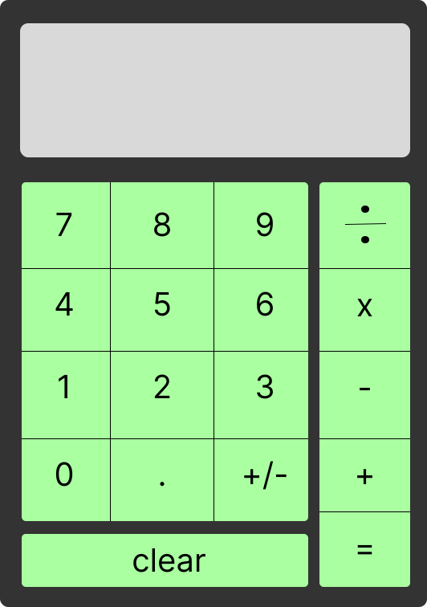

# Calculator Project Documentation
### PROBLEM
Create a calculator program that evaluates a single arithmetic operation at a time. The calculator provides buttons for the user to enter the first operand number, followed by an arithmetic operator, and finally the second operand number. The result is displayed after the user clicks the equal button.
* Arithmetic operations include add, subtract, multiply, and divide.
* A single operation involves two operands and an operator.
* The calculator provides digit, operator, and clear buttons, and a display.
* The calculator displays the numbers and operator as the user presses buttons.
* After the equals button is pressed, the result is displayed.
* Only a single arithmetic operation is evaluated at a time.
* If a second operator is pressed, the result of the first operation is used as the new operand for the second operator.
* Decimal results should be rounded to avoid long displays.
* No operation should take place if the equals button is pressed without two operands and an operator.
* If dividing by zero is attempted, a message is displayed to avoid the operation.
* If operators are pressed consecutively, only the most recent operator should be used for the operation.
* After a result is displayed, pressing any digit should clear the display and start a new operation.

### PLAN
**UI**  

- Display
- Digit buttons
- Operator buttons
- Clear button

**Input**
- First operand (number)
- Operator (symbol)
- Second operand (number)

**Output**
- Operation result (number)
- Previous operation (string)
- Divide by zero error message (string)

**Process**
1. Get the first operand
2. Get the operator
3. Get the second operand
4. Display the input when buttons are pressed
5. Evaluate the operation when equals or second operator is pressed 
6. Display the result
7. After a result, clear the display when digits are pressed

### ALGORITHM
```
SET global operation object holding:
    first operand variable
    second operand variable
    operator id variable
    operator symbol variable
    result variable
    operate function:
        CONVERT first operand into a number
        CONVERT second operand into a number
        CASE operator id OF
            ADDITION: call add function with operands, set to result
            SUBTRACTION: call subtract function with operands, set to result
            MULTIPLICATION: call multiply  with operands, set to result
            DIVISION: call divide with operands, set to result
        ENDCASE
        CALL display and PASS previous operation container and output text content
        CALL display and PASS output container and result
SET global previous operation to DOM previous operation div
SET global output to DOM output div
SET global digits to DOM digits container
SET global operators to DOM operators container

FUNCTION add TAKES two addends
    RETURN the sum of both addends
ENDFUNCTION

FUNCTION subtract TAKES a minuend and a subtrahend
    RETURN the difference of minuend minus subtrahend
ENDFUNCTION

FUNCTION multiply TAKES a multiplicand and a multiplier
    RETURN the product of multiplying multiplicand by multiplier
ENDFUNCTION

FUNCTION divide TAKES a dividend and a divisor
    RETURN the quotient of dividing dividend by divisor
ENDFUNCTION

FUNCTION display TAKES display node and string output
    SET display node's text content to the string output
ENDFUNCTION

FUNCTION set operation TAKES digit click event
    SET text content to digit node text content
    DECLARE newOutput 
    IF operator id is empty THEN
        SET first operand to its current content plus text content
        SET newOutput to first operand
    ENDIF
    ELSE
        SET second operand to its current content plus text content
        SET newOutput to first operand, operator symbol, and second operand
    ENDELSE
    CALL display and PASS output container, and newOutput string
ENDFUNCTION

FUNCTION evaluate operation takes operator click event
    SET operator node to event target
    IF node id is equals button THEN
        CALL operate on operation object
    ENDIF
    ELSEIF second operand is empty THEN
        SET operator id to node id
        SET operator symbol to node text content
        CALL display and PASS output node and output content plus symbol
    ENDELSEIF
ENDFUNCTION

FUNCTION clear
    FOR each key in operation
        IF current key is NOT operate function THEN
            SET current key value to empty string
        ENDIF
    ENDFOR
    SET previous operation text content to an empty string
    SET output text content to an empty string
ENDFUNCTION

LISTEN for digits container click event
    CALL set operation and PASS click event
ENDLISTEN

LISTEN for operators container click event
    CALL evaluate operation and PASS click event
ENDLISTEN
```